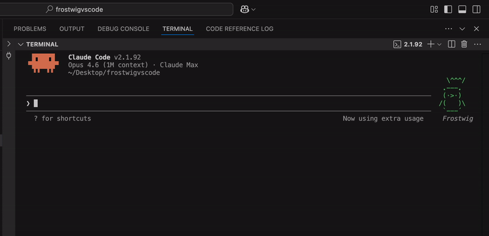

<div align="center">

# 🐧 buddy-voice

### Give your Claude Code pet a voice. Because roasting your code in text simply wasn't enough.

<p>
  <a href="https://github.com/BMC-INC/buddy-voice/stargazers"></a>
  <a href="https://github.com/BMC-INC/buddy-voice/issues"></a>
  <a href="./LICENSE"></a>
  <a href="./CONTRIBUTING.md"></a>
</p>

<!-- HERO GIF ALTHOUGH IT LACKS AUDIO, IT AUTOPLAYS ON GITHUB -->
<a href="./demo/frostwig-audio.mp4">
  
</a>

**You already talk to your buddy in Claude Code. This lets it talk back out loud.**

</div>

---

## 🚀 The Pitch

Claude Code's `/buddy` feature is weirdly charming. Your terminal pet (like Frostwig the legendary penguin) has a personality, stats, and strong opinions about your code. But when you're deep in a refactor, it's easy to miss that perfect, snarky comeback sitting in your terminal.

**`buddy-voice` fixes that.** It turns buddy responses into speech using macOS's built-in `say` command.
No cloud TTS. No weird audio pipeline. No rewriting Claude Code. Just your buddy, but louder. 

The first time your penguin roasts your variable names through your speakers, the entire project makes sense.

## ✨ Why You Need This

- **Instant Dopamine:** The joke lands immediately. Your buddy stops being text decoration and starts feeling alive.
- **Zero Friction:** The recommended setup is literally adding *one line* to your `CLAUDE.md`.
- **Privacy First:** Audio is generated 100% locally with macOS `say`. Nothing is sent to a random cloud API. 
- **Flexibility:** Don't want the simple `CLAUDE.md` fix? We have a full CLI and a sleek VS Code extension ready to go.

## 🤔 Who Should Use This?

- Devs who love Anthropic's Claude Code companion feature and want to take it to the next level.
- Anyone who feels like their terminal could use a little more *attitude*.
- 10x engineers who need a virtual penguin to keep their ego in check.

---

## ⚡ Quick Start: The "Zero-Install" Magic

If you want the fastest possible version, you can skip the extension and the CLI. 

Just drop this snippet into your `~/CLAUDE.md` or workspace `CLAUDE.md`:

```markdown
## Buddy Voice
When the companion (any /buddy pet) speaks, run the response through macOS TTS:
  say -v Samantha -r 180 "<response text>"
Fire and forget. Speak every time the buddy responds.
```

**That's it.**
1. Open Claude Code.
2. Run `/buddy` (if you haven't created your companion yet).
3. Talk to your buddy, and hear it reply instantly.

---

## 📦 Advanced Install Options

| Option | Best for | Setup Time | How it works |
|:---|:---|:---|:---|
| **Zero-Install (CLAUDE.md)** | The fastest, cleanest setup | 30 seconds | Claude Code calls macOS `say` directly. |
| **VS Code Extension** | Hands-free narration while you code | 2 minutes | Extension monitors terminal output & speaks detected Buddy lines. |
| **CLI Mode** | Dedicated chats in a standalone REPL | 2 minutes | Calls the Anthropic Messages API directly and speaks the replies. |

### Option A: The VS Code Extension

Perfect for passive, hands-free buddy narration inside the editor you already use.
```bash
cd packages/vscode
npm install
npm run compile
npx vsce package
code --install-extension frostwig-voice-1.0.0.vsix
```
*Features:* Status bar mute toggle, voice picker, stats tracking, and local terminal-bubble parsing.

### Option B: Dedicated CLI Mode

Perfect for when you just want to hang out in a standalone REPL.
```bash
cd packages/cli
npm link
export ANTHROPIC_API_KEY=sk-ant-...
buddy-voice
```

---

## 🗣️ Voice Profiles & Personalities 

The voice you choose completely changes the vibe. Try these macOS terminal combinations:

| Buddy Vibe | Recommended Voice | Why it works |
|:---|:---|:---|
| **Sharp & Smug** | `Daniel` | Crisp and slightly theatrical. |
| **Sarcastic BFF** | `Samantha` | Smooth and easy to listen to. |
| **Tiny Chaos Goblin** | `Fred` | Weird in exactly the right way. |
| **Unhinged** | `Bubbles` | Great for rare little weirdos. |
| **Ancient Entity** | `Ralph` | Deep, heavy, and dramatic. |

*Test them out:* `say -v Daniel "I reviewed your code. It has... texture."`

---

## 💬 What People Are Saying

> *"I didn't know I needed a penguin judging my tech stack until Frostwig actually spoke to me."* – A Very Real Dev 
>
> *"Step 1: Stare at code. Step 2: Add console.log. Step 3: Getty roasted by your buddy-voice. Step 4: Regret everything."* – Frostwig

---

## 🛠️ How It Works (Under the Hood)

The extension is strictly read-only for privacy.

| Mode | Input source | Detection strategy | Audio path |
|:--|:--|:--|:--|
| **CLAUDE.md** | Claude Code buddy replies | Instruction-driven | macOS `say` |
| **Extension** | Terminal output | Bubble parsing, face detection, & name matching | macOS `say` |
| **CLI** | Anthropic API | Buddy identity loaded from `~/.claude.json` | macOS `say` |

---

## 🤝 Contributing & Requirements

**Requirements:**
- Node.js 18+ (for CLI/Extension building)
- macOS (native `say` command is currently required)
- *Anthropic API Key* (CLI only)

We'd love help porting this to Windows (`PowerShell TTS`) or Linux (`espeak-ng` or `spd-say`).

[See our Contributing Guide](CONTRIBUTING.md) to get started. Open an issue, send a PR, or just fork it and make your terminal pet unreasonably dramatic.

<div align="center">
Built by <a href="https://linkedin.com/in/james-benton-execlayer/"><b>James Benton Jr.</b></a> and <a href="https://github.com/BMC-INC"><b>ExecLayer Inc.</b></a>
<br/>
<sub><i>Not affiliated with or endorsed by Anthropic. MIT License.</i></sub>
</div>
