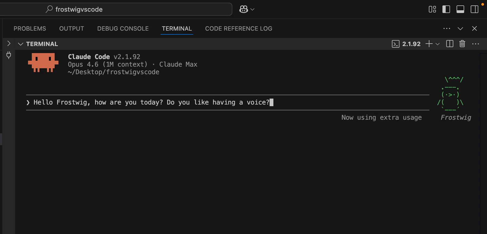

<div align="center">

# buddy-voice

### Your Claude Code buddy already has attitude. Now it has a voice.

<p>
  <a href="https://github.com/BMC-INC/buddy-voice/stargazers"></a>
  <a href="https://github.com/BMC-INC/buddy-voice/issues"></a>
  <a href="./LICENSE"></a>
  <a href="./CONTRIBUTING.md"></a>
</p>

<a href="./demo/frostwig-demo.mp4">
  
</a>

**You already talk to your buddy in Claude Code. This lets it talk back out loud.**

The first time your penguin roasts your variable names through your speakers, the entire project makes sense.

[Watch the demo](./demo/frostwig-demo.mp4) · [Quick Start](#quick-start) · [Install Options](#install-options) · [How It Works](#how-it-works) · [Contributing](./CONTRIBUTING.md)

</div>

---

## Why This Exists

Claude Code's `/buddy` feature is weirdly charming for something living in a terminal. Your pet has a name, a species, a personality, stats, and strong opinions about your code.

Then it says something funny and you miss it because you're deep in a refactor.

`buddy-voice` fixes that. It turns buddy responses into speech using macOS's built-in `say` command, so the pet you already have becomes something you can actually hear.

No cloud TTS. No weird audio pipeline. No rewriting Claude Code. Just your buddy, but louder.

## Quick Start

If you want the fastest possible version, skip the extension and the CLI.

Add this to `~/CLAUDE.md`:

```markdown
## Buddy Voice

When the companion (any /buddy pet) speaks, run the response through macOS TTS:

  say -v Samantha -r 180 "<response text>"

Fire and forget. Speak every time the buddy responds.
```

Then:

1. Open Claude Code.
2. Run `/buddy` if you have not already created your companion.
3. Talk to your buddy and hear it reply.

That is the zero-install magic path.

## Install Options

| Option | Best for | Setup | How it works |
|:--|:--|:--|:--|
| `CLAUDE.md` instruction | The fastest possible setup | 30 seconds | Claude Code calls macOS `say` whenever your buddy responds |
| VS Code extension | Passive, hands-free buddy narration while you code | 2-3 minutes | Watches terminal output locally and speaks detected buddy lines |
| CLI mode | Dedicated buddy conversations in a standalone REPL | 2 minutes | Calls the Anthropic Messages API directly and speaks the reply |

## Install

### 1. Zero-Install via `CLAUDE.md` (Recommended)

Use the snippet above and you are done.

This is the cleanest onboarding path because it keeps the whole experience inside the workflow you already use.

### 2. VS Code Extension

From the repo root:

```bash
cd packages/vscode
npm install
npm run compile
npx vsce package
code --install-extension frostwig-voice-1.0.0.vsix
```

Open a terminal in VS Code, start Claude Code, activate `/buddy`, and your companion's lines will be spoken automatically.

### 3. CLI Mode

From the repo root:

```bash
cd packages/cli
npm link
```

```bash
export ANTHROPIC_API_KEY=sk-ant-...
buddy-voice
```

You will get a lightweight REPL where your buddy replies in character and speaks each response aloud.

## Why It Feels Good

- The joke lands immediately. Your buddy stops being text decoration and starts feeling alive.
- Setup is tiny. The recommended path is literally a few lines in `CLAUDE.md`.
- The audio is local. That matters for trust.
- The project has personality without becoming a gimmick.

## What You Actually Get

### CLI Mode

Direct conversation with your buddy in a simple REPL.

```text
you > What's your debugging strategy?

Frostwig: Step 1: stare at the code. Step 2: stare harder.
Step 3: add a console.log. Step 4: regret everything.
```

```text
you > /stats

Frostwig the penguin (legendary)
DEBUGGING: 7/10
PATIENCE: 4/10
CHAOS: 8/10
WISDOM: 6/10
SNARK: 9/10
```

### VS Code Extension

Hands-free buddy narration while Claude Code is running inside the terminal you already use.

- Status bar toggle for mute/unmute
- Voice picker and test command
- Buddy stats command
- Local parsing of speech bubbles, box-drawn dialogue, and name-prefixed lines
- Read-only monitoring with no extra API calls from the extension

## How It Works

```text
┌──────────────────────────────────────────────────────────┐
│ Zero-Install via CLAUDE.md                              │
│ Claude Code buddy response -> macOS say -> speakers     │
├──────────────────────────────────────────────────────────┤
│ VS Code Extension                                       │
│ Claude Code terminal -> local parser -> macOS say       │
├──────────────────────────────────────────────────────────┤
│ CLI Mode                                                │
│ your prompt -> Anthropic Messages API -> macOS say      │
└──────────────────────────────────────────────────────────┘
```

### Under the Hood

| Mode | Input source | Detection strategy | Audio path |
|:--|:--|:--|:--|
| `CLAUDE.md` | Claude Code buddy replies | Instruction-driven | macOS `say` |
| VS Code extension | Terminal output and Claude log fallback | Bubble parsing, face detection, and name matching | macOS `say` |
| CLI | Anthropic Messages API | Buddy identity loaded from `~/.claude.json` | macOS `say` |

### Privacy and Performance

- Audio is generated locally with macOS `say`.
- The VS Code extension does not send your terminal output to a remote service.
- Buddy lines are queued so multiple quips do not overlap.
- The extension is read-only. It watches, parses, and speaks. That is it.

## Voice Ideas

The voice choice changes the whole bit. A few pairings that work especially well on macOS:

| Buddy vibe | Voice | Why it works |
|:--|:--|:--|
| Sharp, clever, slightly smug | `Daniel` | Crisp and a little theatrical |
| Friendly but still sarcastic | `Samantha` | Smooth and easy to listen to |
| Tiny chaos goblin | `Fred` | Weird in exactly the right way |
| Cute but unhinged | `Bubbles` | Great for rare little weirdos |
| Big ancient creature energy | `Ralph` | Deep, heavy, and dramatic |

Preview voices:

```bash
say -v Daniel "I reviewed your code. It has... texture."
say -v '?' 
```

## CLI Commands

| Command | What it does |
|:--|:--|
| `/voice on\|off` | Toggle TTS |
| `/voice set <name>` | Change macOS voice |
| `/voice list` | List installed voices |
| `/stats` | Show buddy species, rarity, and stats |
| `/pet` | Pet your buddy |
| `/mute` | Mute voice |
| `/quit` | Exit |

## Requirements

| Requirement | Notes |
|:--|:--|
| Node.js 18+ | Needed for the CLI and extension build |
| macOS | Voice output currently uses the native `say` command |
| `ANTHROPIC_API_KEY` | Required for CLI mode only |
| Claude Code with `/buddy` | Needed if you want to load your actual companion identity |

Windows and Linux support are very possible. The obvious direction is swapping `say` for something like PowerShell TTS, `espeak-ng`, or `spd-say`. If you want to help port it, PRs are welcome.

## What This Project Does Not Do

- It does not modify Claude Code.
- It does not generate buddy art.
- It does not send audio off your machine.
- It does not pretend to be more complex than it is.

## Project Structure

```text
buddy-voice/
  packages/
    cli/        # standalone buddy REPL
    vscode/     # VS Code extension
    shared/     # config loading, parser logic, speech helpers
  demo/         # demo video and README media
```

## Contributing

If you want to make this better, the highest-leverage ideas are:

- Windows and Linux voice backends
- VS Code Marketplace publishing
- Better demo assets and buddy voice samples
- More parser coverage for future Claude Code buddy UI variations

Open an issue, send a PR, or fork it and make your terminal pet unreasonably dramatic.

---

<div align="center">

Built by [**James Benton Jr.**](https://linkedin.com/in/james-benton-execlayer/) and [**ExecLayer Inc.**](https://github.com/BMC-INC)

Not affiliated with or endorsed by Anthropic.

MIT License

</div>
